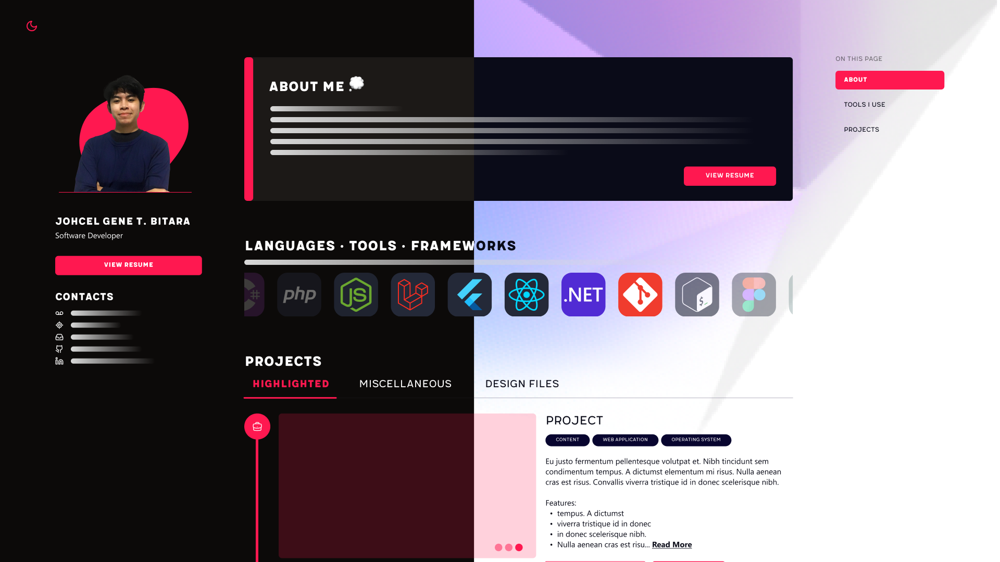

<div align="center">

## Professional Portfolio

[View Live Demo](https://jbitaraportfolio.web.app) • [Report a Bug](https://github.com/genebit/portfolio/issues)



</div>

<details>
<summary><b>Table of Contents</b></summary>

1. [About the Project](/README.md)

   - [Built With](/README.md#technology-stack)
   - [Resources Used](/README.md#resources-used)

2. [Getting Started](/README.md#getting-started-📌)

   - [Prerequisites](/README.md#prerequisites)
   - [Installation](/README.md#installation)

3. [License](/README.md#license-✍)
</details>

#### **About**

This repository is simple todo (learning React) application that utilizes the browser's local storage.

#### **Technology Stack**


#### **Resources Used**

[](https://skillicons.dev)

## **Getting Started** 📌

#### Prerequisites

Before running the application, make sure to install the following:

1. NodeJS (NPM).

   Download through their official [docs](https://nodejs.org/en/download).

   ```bash
   npm install npm@latest -g
   ```

#### Installation

1. Clone this repository

   ```bash
   git clone https://github.com/genebit/portfolio.git
   ```

   Upon cloning, bavigate to the repo.

2. Install NPM packages

   ```bash
   npm install
   ```

   That's it! You can now start by running the application.

3. Start the application
   ```bash
   npm run dev
   ```

### Firebase Deployment

1. Initialize Firebase config. Answer the prompt and redirect it from `public` to `dist`. Because dist is the output build file for vite

   ```bash
   firebase init
   ```

2. Build the repo.

   ```bash
   npm run build
   ```

3. Deploy to Firebase
   ```bash
   firebase deploy
   ```

## **License** ✍

Distributed under the MIT License. See LICENSE.txt for more information.
